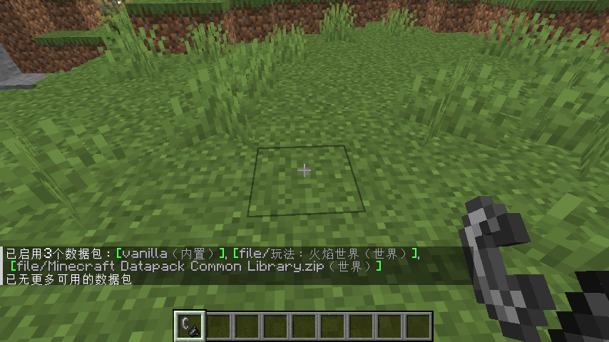
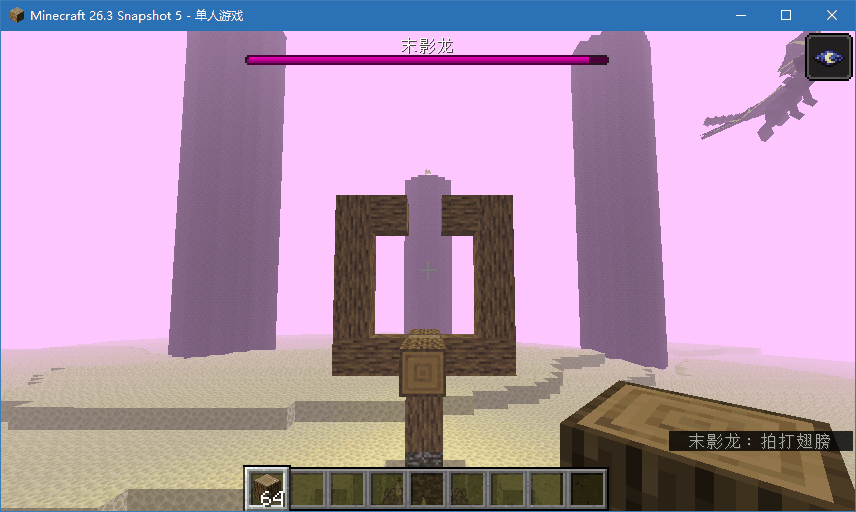
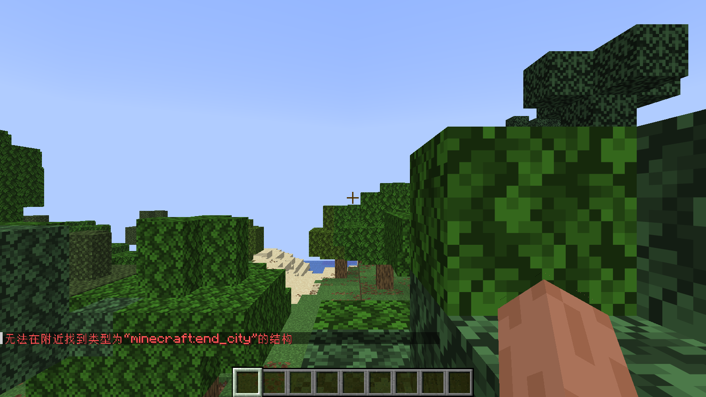
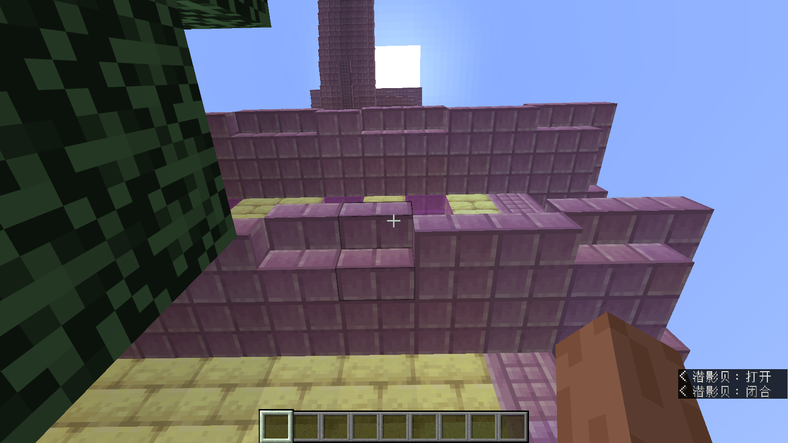
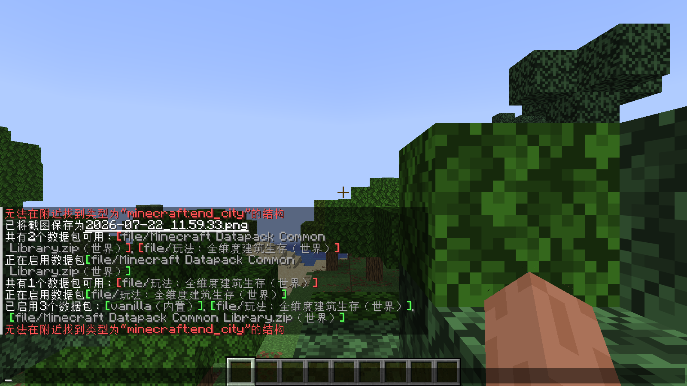
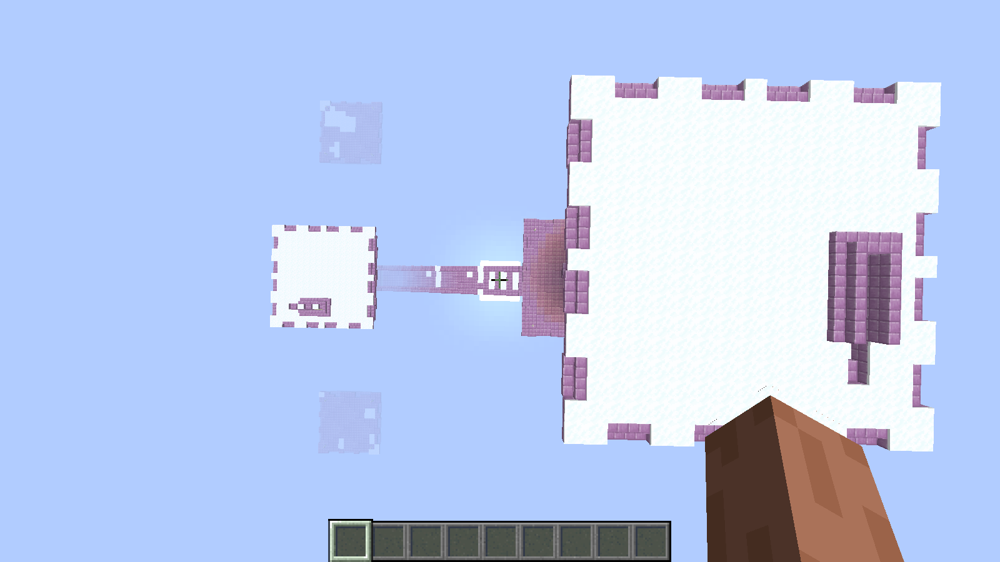
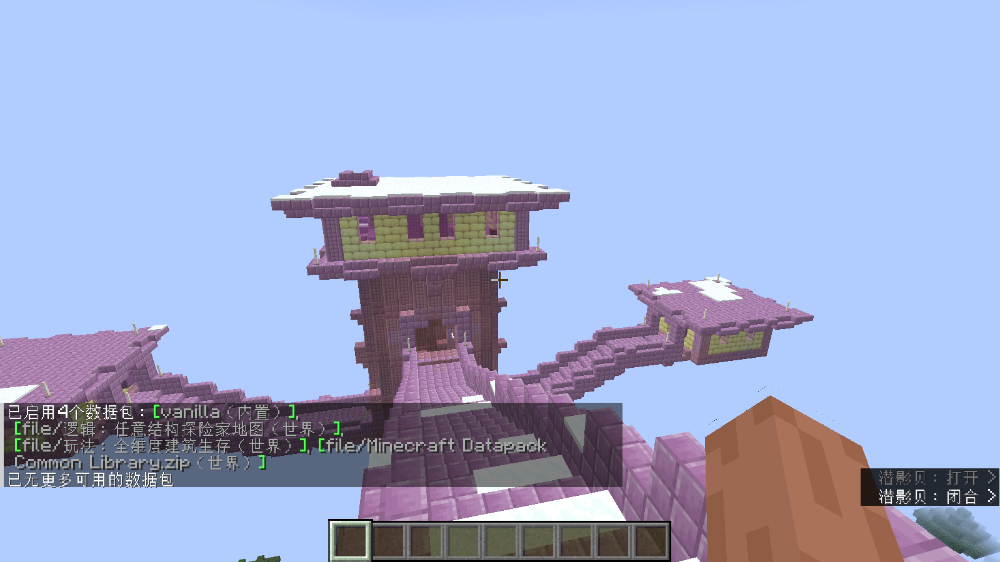
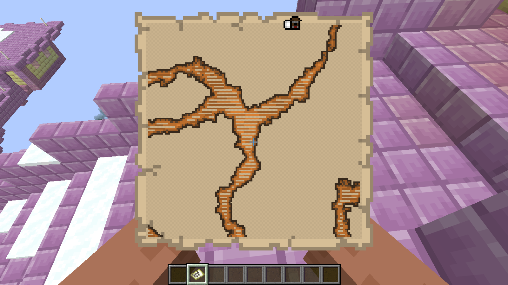

# **文档**

## **使用标签来实现一些逻辑和玩法**

当前数据包通用库只实现了 [基本标签](术语.md)，所以当前只有通过标签来实现逻辑和玩法。

你需要新建一个世界，以确保使用了通用库的数据包不会影响其他数据包/被其他数据包影响。

在 ../example/tutorial 中包含了本文档所举例子的资源，可以配套使用。

## **方块标签**

### **玩法：火焰世界**

**需要 Minecraft 版本 1.20+。**

这个玩法的内容是所有方块上都会永久燃烧火，形成“火焰世界”的视觉效果。

在未加载数据包前，火会自然熄灭：


**图 未加载数据包前，火会自然熄灭**

将游戏原版的[维度类型定义文件](https://zh.minecraft.wiki/w/维度类型)（位于原版中的 data/minecraft/dimension_type）解压出来，放到你数据包的 data/<你的命名空间>/dimension_type 中。

现在将维度类型定义文件的 infiniburn 字段修改一下，使用通用库的 vanilla_all_blocks 标签：

```JSON
// 主世界的维度类型定义文件
{
	"has_skylight": true,
	"min_y": -64,
	"height": 384,
	"infiniburn": "#common:vanilla_all_blocks",
	"monster_spawn_block_light_limit": 0,
	... // 省略其它的字段
}
```

把你的数据包拷贝进你的世界（在 <实例目录>/saves/<你的世界>/datapacks），就像这样：



**图 加载火焰世界数据包后**

然后退出重进，用打火石点个火，现在火焰会在你点燃的方块上永久燃烧了。

为了实现火焰世界，你还需要修改游戏规则。

**1.21.5~1.21.10：**

```
/gamerule allowFireTicksAwayFromPlayer true
```

**1.21.11 之后：**

```
/gamerule fire_spread_radius_around_player -1
```

这样火焰将会一直蔓延，并且由于火焰会在所有方块上永久燃烧，所以就形成了火焰世界。

效果：


**图 现在火不会自然熄灭，而且还不断蔓延**

**注意**

过多的火焰会造成严重的性能负担，所以你应该合理修改 fire_spread_radius_around_player 的值而不是无限制蔓延。

### **逻辑：末影龙不会破坏方块**

在原版游戏中，只有 `#minecraft:dragon_immune` 标签下的方块不会被末影龙破坏，其中并不包括主世界常见的圆石和深板岩圆石等石头，也不包括速通玩家喜欢的床。

为此，你需要修改 `#minecraft:dragon_immune` 标签来阻止末影龙破坏方块。从原版数据包中获取 `#minecraft:dragon_immune`（位于原版数据包的 data/minecraft/tags/blocks/dragon_immune.json（24w18-）或 data/minecraft/tags/block/dragon_immune.json（24w19+））。将其中内容修改成这样：

```json
{
	"values": [
		"#common:vanilla_all_blocks"
	]
}
```

由于这里只是添加新方块到标签，replace 字段可以省略。

现在将你的数据包拖进世界里，用 /reload 命令热重载，末影龙就不会破坏任何方块了。



**图 现在末影龙不会破坏任何方块了**

## **生物群系标签**

### **玩法：全维度建筑生存**

该玩法将不同维度的结构在所有维度中生成，包括只出现在特定生物群系的结构（例如平原村庄只出现在平原）、只出现在特定维度的结构（例如末地城只出现在末地、下界要塞只出现在下界）。

为了实现全维度建筑生存，你需要让建筑可以在任何生物群系中生成。`#minecraft:is_overworld`、`#minecraft:is_nether` 和 `#minecraft:is_end` 标签存储了各自维度的生物群系，因此你需要添加所有生物群系，不然按照原版的世界生成，结构只会生成在其所在生物群系的维度中。

以末地城为例，在没有修改之前，在主世界运行 `/locate structure minecraft:end_city` 会报错无法在附近找到类型为“minecraft:end_city”的结构。



**图 未修改时，运行 /locate 命令在主世界找不到末地城**

有两种方法可以实现该玩法：

1. **修改结构定义文件**

从原版数据包中获取结构定义文件（位于 data/minecraft/worldgen/structure），修改每个结构定义文件的 `biomes` 字段为 `#common:vanilla_all_biomes`。

将你的数据包拷进世界，然后退出重进，使用 /locate strcuture 命令搜索原本不会出现在该维度或生物群系的结构，应该会返回那个结构的坐标。
· 也可以使用通用库的 `#common:vanilla_all_structures` 结构标签来搜索任意结构，例如：

```
/locate structure #common:vanilla_all_structures
```

2. **修改生物群系标签**

如果你计划将这个玩法支持多个版本，那么一个一个修改太费劲了。幸好，原版结构部用标签指定能生成此结构的生物群系。

修改它们的生物群系标签可简单多了，因为所引用的标签万古不变，因此只需修改一次就能在多个版本中使用。

现在，让我们修改每个结构所引用的标签（都以 has_structure/ 开头）：

```Shell
:: Windows Batch 脚本
:: 复制这个脚本到 change_structure_biome_tags.cmd 然后运行
:: bz 命令包含在 https://github.com/GetSoftwares/SpyglassMCFiles 存储库中，运行前需要先克隆该存储库并初始化，详见 ../README.MD
@echo off
call bz x -o:"<你的数据包>" -fmt:tgz "%MINECRAFT_SPYGLASSMC_ROOT%\versions\<Latest Snapshot>\vanilla-data.tar.gz" data\minecraft\tags\worldgen\biome\*.json 1>NUL
for /F "tokens=*" %%a in ('dir "<你的数据包>\data\minecraft\tags\biome\has_structure\*.json" /A:-D /B /O:N') do (
    echo.{
    echo.    "values": [
    echo.         "#common:vanilla_all_biomes"
    echo.     ]
    echo.}
) > "<你的数据包>\data\minecraft\tags\worldgen\biome\has_structure\%%~a"
exit /b 0
```

**注意：bz 要用 call 的方式调用，否则解压完后会直接结束脚本运行。**

然后将你的数据包拷进世界里，退出重进世界，然后使用

```
/locate structure #common:vanilla_all_structures
```

搜索本不该生成在这里的结构，然后传送过去（点击坐标就可以传送）。那么恭喜你，成功实现了这个玩法。


**图 修改后可以在主世界 /locate 到末地城**



**图 在主世界的末地城**

**注意**

标签可以热重载，但结构并不会因此就可以马上在所有生物群系生成。你需要退出重进才能让它们在任何生物群系都能生成。



**图 未重进世界前，末地城依旧无法在主世界生成生成**

_覆雪末地城_



## **结构标签**

### **逻辑：任意结构探险家地图**

接上 **玩法：全维度建筑生存**，由于结构的增多，你需要一个不开作弊也能找到结构的方法，就是探险家地图。

探险家地图用来指示特定结构的位置，例如埋藏的宝藏（藏宝图）、试炼密室（试炼探险家地图）和海底神殿（海洋探险家地图）。通过物品修饰器，探险家地图可以指向任何结构。

接下来我们来创建一个物品修饰器，命名为 random_structure_locater.json，存放在你数据包的 data/<你的命名空间>/item_modifier 中。

在 random_structure_locater.json 中填入以下内容：

```json
{
	"function": "exploration_map",
	"destination": "common:vanilla_all_structures"
}
```

注意到 destination 字段的值前面没有加 #，虽然此字段是一个结构标签。现在我们需要创建一个战利品表，位于你数据包的 data/<你的命名空间>/loot_table/give_explorer_map.json，内容如下：

```json
{
	"type": "minecraft:generic",
	"pools": [
		{
			"rolls": 1,
			"entries": [
				{
					"type": "item",
					"name": "minecraft:map",
					"functions": [
						{
							"function": "reference",
							"name": "<你的命名空间>:random_structure_locater"
						}
					]
				}
			]
		}
	],
	"random_sequence": "<你的命名空间>:give_explorer_map"
}
```

记得将 `<你的命名空间>` 替换为你的命名空间。将数据包拖入世界，然后运行 /reload，就像这样：



**图 将“任意结构探险家地图”数据包加载进世界后显示的数据包列表**

运行 /loot give @s loot <你的命名空间>:give_explorer_map，你会获得一个探险家地图。



**图 探险家地图成功找到了刚才生成的末地城**

由于未设置地图图标，所以地图会以林地府邸来显示图标。这不重要，只需要能定位任何结构就可以了（虽然可能会对玩家造成误导）。

## **更多教程**

还有许多教程没有列出，不过你可以自己发觉玩法或者自定义逻辑，然后如果你要写的内容通用库正好实现了就可以直接使用了。

## **遇到了问题？**

### **如何获取原版数据包的文件？**

原版的数据包被放在了 Minecraft 的 jar 文件里，其本质上是一个 zip 文件。你可以用你的压缩软件（例如 7-Zip，应该在准备构建通用库的时候就安装了吧）打开 Minecraft 的 jar 文件（通常是 <实例名>.jar），将其中的 data 目录解压出来，就得到了原版的数据包。

从 Minecraft Java 版 18w01a 开始，游戏内置了数据生成器，可以到处原版数据包。使用 HMCL 启动器，选择或创建一个项目并生成启动脚本，将脚本中 net.minecraft.client.main.Main 及以后的内容替换成
`net.minecraft.data.Main --server`
然后启动脚本，Minecraft 应该会自动导出原版数据包到 ./generated 目录中，你就得到了原版数据包。注意数据生成器并不会导出所有内容，例如结构文件就不会导出。

### **提示未设置 SpyglassMC？**

你需要先克隆 [SpyglassMCFiles](https://github.com/GetSoftwares/SpyglassMCFiles) 存储库，因为通用库的构建依赖于从 SpyglassMC 下载的文件。

下载并安装 Git，然后运行

```
git clone https://github.com/GetSoftwares/SpyglassMCFiles
```

到另一个目录，然后设置 MINECRAFT_SPYGLASSMC_ROOT 环境变量为那个目录，退出重进或重启计算机来生效。

也可以在克隆存储库之后编辑通用库项目的 config/build.json（不存在则新建），然后设置 spyglassmc_root 字段为你克隆到的那个目录，不需要重启即可生效。
